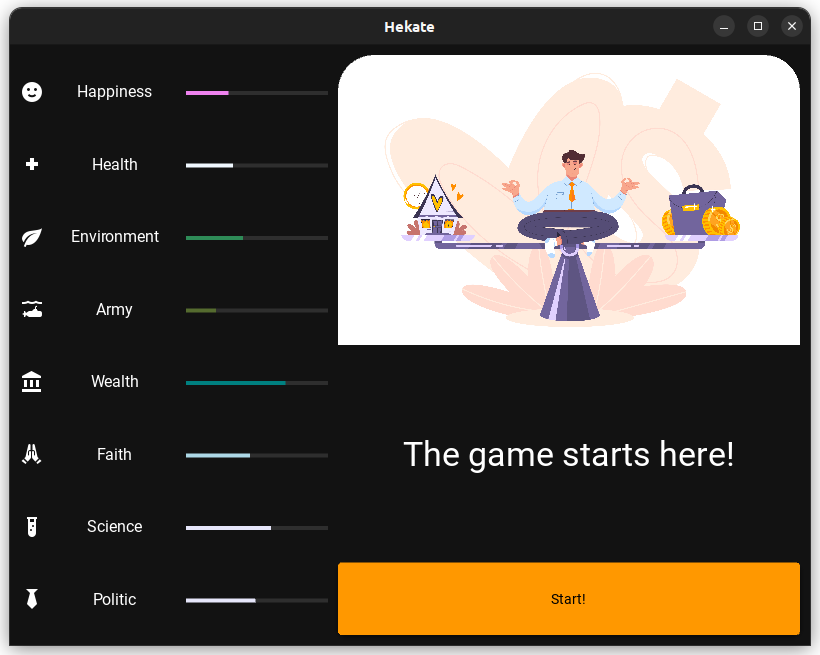
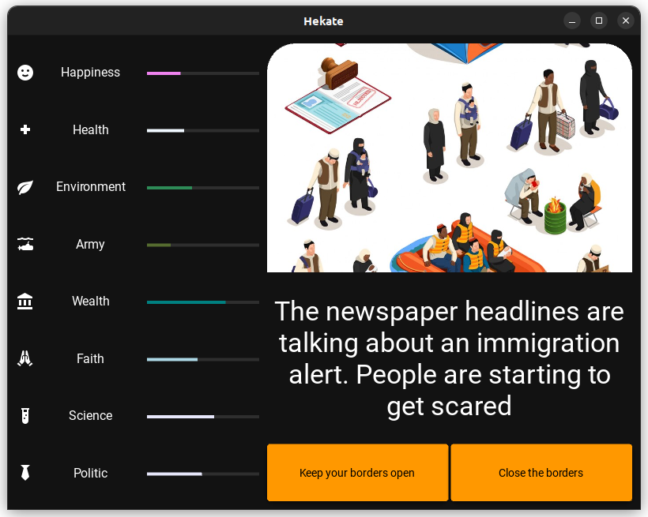
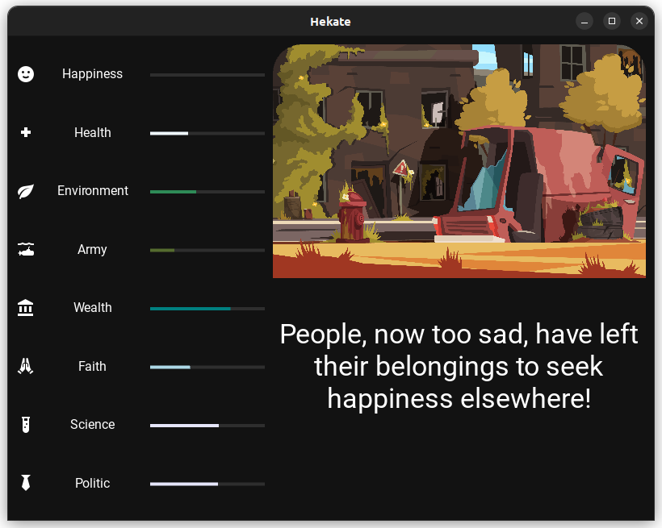
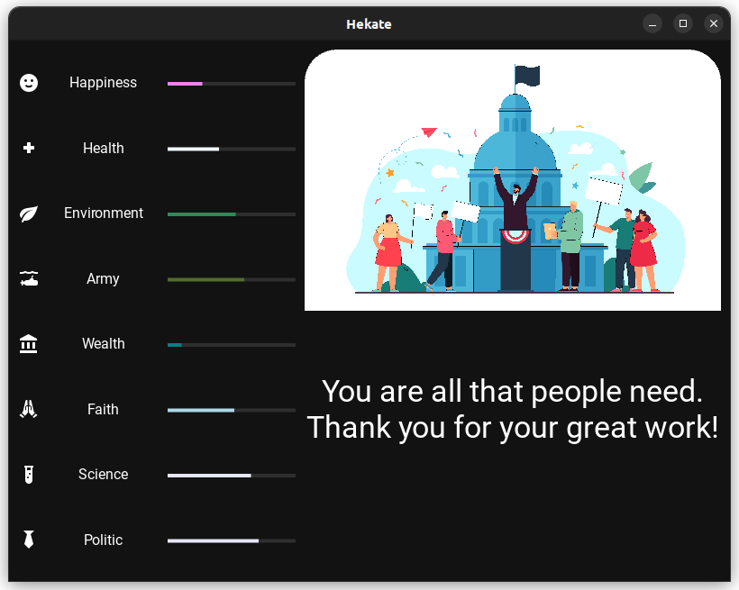

# Hekate

A game about the importance of strategic choices

Use the software at your own risk. Continuous code developments may cause you to lose your game data.

# The Story

The people needed someone to lead them wisely, and right then you were there ready to take on the burden of that task. Will you live up to expectations?

# Screenshoots

## Game start

## Card Example

## Defeat

## Victory

---

# Support

# Acknowledgements

<a href='https://www.freepik.com/vectors'>Cards images from www.freepik.com</a>
